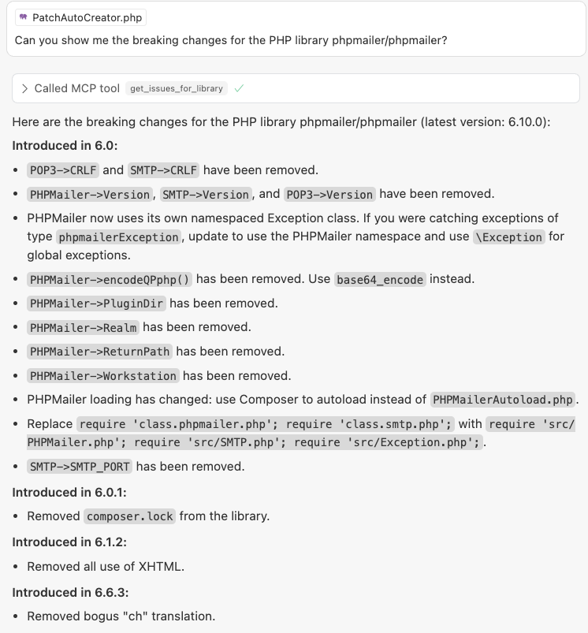

# PatchEvergreen MCP Server & Skill

This repository provides both a Model Context Protocol (MCP) server and an Agent Skill for accessing PatchEvergreen's breaking changes database. The MCP server provides tool access, while the Skill provides expert workflows and guidance for analyzing breaking changes across multiple programming languages.

## What's New: Skills Support

This package now includes a **Skill** (`SKILL.md`) that can be used across multiple AI coding tools including:
- **Claude Code** (claude.ai)
- **Cursor**
- **OpenClaw (Clawdbot)**
- **VS Code** (with MCP support)
- Any MCP-compatible tool

Skills provide the expertise and workflow knowledge, while the MCP server provides the underlying tool access. They work together to deliver a complete solution.

## MCP Server

The MCP server is a lightweight Model Context Protocol server that interfaces with the PatchEvergreen API to fetch issues for breaking changes for libraries. It uses FastMCP for proper MCP implementation. It does not (currently) support API access tokens, so all accesses are "slow" requests into that API.

Please note that libraries are named as written in their respective ecosystem tools, so as you would type them in files like:

- composer.json (php)
- requirements.txt (python)
- manifest.json (Javascript)
- gemfile (Ruby)
- package.json (Javascript)
- cargo.toml (Rust)
- libs.versions.toml (Java)
- pom.xml (Java)
- build.gradle.kts (Kotlin)

## Setup

The file mcp_server is a stdio server that assumes you have a working copy of Python 3 installed on your machine.

Install the required dependencies:
```bash
pip3 install -r requirements.txt
```
[If you are using tools like venv or Docker to run Python, you will need to configure them in your normal way.]

## SSE

The file mcp_server_sse is a copy of the stdio file intended for hosting on servers. You probably don't want to do this, but we include it for reference.

To run it, just run python3 mcp_server_sse.py


## Using as a Skill

### Quick Start

1. **Install the MCP Server** (see Setup section below)
2. **Configure your tool** to use the PatchEvergreen MCP server
3. **Load the Skill** - The `SKILL.md` file contains all the workflow instructions and expertise

The Skill automatically teaches your AI assistant how to:
- Analyze breaking changes for libraries
- Plan version upgrades
- Conduct dependency audits
- Assess compatibility impacts
- Generate migration reports

### Cross-Platform Usage

#### Claude Code / Claude Desktop

1. Connect the PatchEvergreen MCP server (SSE or stdio)
2. Reference the `SKILL.md` file or load it as a skill resource
3. The skill will guide Claude on how to use the MCP tools effectively

#### Cursor

1. Configure the MCP server in `.cursor/mcp.json` (see configuration examples below)
2. The skill can be loaded as a resource or referenced directly
3. Cursor will use both the MCP tools and skill workflows

#### OpenClaw (Clawdbot)

1. Configure the MCP server connection
2. Load the `SKILL.md` file as a skill
3. OpenClaw will use the skill's workflows with the MCP server tools

### Skill Features

The Skill provides five specialized workflows:

1. **Quick Breaking Changes Check** - Fast overview of breaking changes
2. **Comprehensive Analysis** - Detailed analysis with migration guidance
3. **Dependency Audit** - Systematic review of all project dependencies
4. **Version Upgrade Planning** - Step-by-step upgrade plans
5. **Compatibility Impact Summary** - Focused compatibility assessment

See `SKILL.md` for complete documentation on workflows and best practices.

## Using with Cursor (MCP Server)

Once installed, this server is designed to be used as a stdio MCP server, typically launched and managed by the Cursor editor. You do not need to run it manually or specify a port.



Cursor automatically communicates with this MCP server over stdio when you invoke MCP features (such as asking for issues for a library) within the editor. No manual requests or HTTP endpoints are needed.

### Configuring MCP Server with .cursor/mcp.json

To configure Cursor to use this MCP server, add a `.cursor/mcp.json` to your project. Example configurations are provided below.

## MCP Endpoint

The server implements the Model Context Protocol (MCP) standard using FastMCP. It automatically handles all MCP-specific communication, including streaming responses.

## Error Handling

The server will return appropriate error messages if:
- No user message is found in the request
- The library and language parameters cannot be parsed from the message
- The PatchEvergreen API request fails
- Any other unexpected errors occur

All responses are handled automatically by FastMCP, including proper streaming and error handling.

## Configuration Examples

### Cursor Configuration (stdio)

Create `.cursor/mcp.json`:

```json
{
  "mcpServers": {
    "PatchEvergreen": {
      "command": "python3",
      "args": ["/path/to/PatchEvergreen-MCP-Server/mcp_server.py"]
    }
  }
}
```

### Cursor Configuration (SSE - for hosted server)

Create `.cursor/mcp.json`:

```json
{
  "mcpServers": {
    "PatchEvergreen": {
      "url": "https://your-hosted-server.com/sse",
      "transport": "sse"
    }
  }
}
```

### Claude Desktop Configuration

Edit your Claude Desktop configuration file (location varies by OS):

```json
{
  "mcpServers": {
    "PatchEvergreen": {
      "command": "python3",
      "args": ["/path/to/PatchEvergreen-MCP-Server/mcp_server.py"]
    }
  }
}
```

Or for SSE:

```json
{
  "mcpServers": {
    "PatchEvergreen": {
      "url": "https://your-hosted-server.com/sse",
      "transport": "sse"
    }
  }
}
```

### OpenClaw Configuration

Configure in OpenClaw's MCP settings to point to either:
- Local stdio server: `python3 /path/to/mcp_server.py`
- Hosted SSE server: `https://your-hosted-server.com/sse`

Then load the `SKILL.md` file as a skill resource.

## Architecture

This package follows the modern Skills + MCP architecture:

- **MCP Server** (`mcp_server.py`, `mcp_server_sse.py`): Provides tool access via the Model Context Protocol
- **Skill** (`SKILL.md`): Provides workflow knowledge and expertise on how to use the tools effectively

This separation allows:
- The MCP server to be used independently for tool access
- The Skill to work with any compatible MCP server
- Cross-platform compatibility through the Agent Skills open standard
